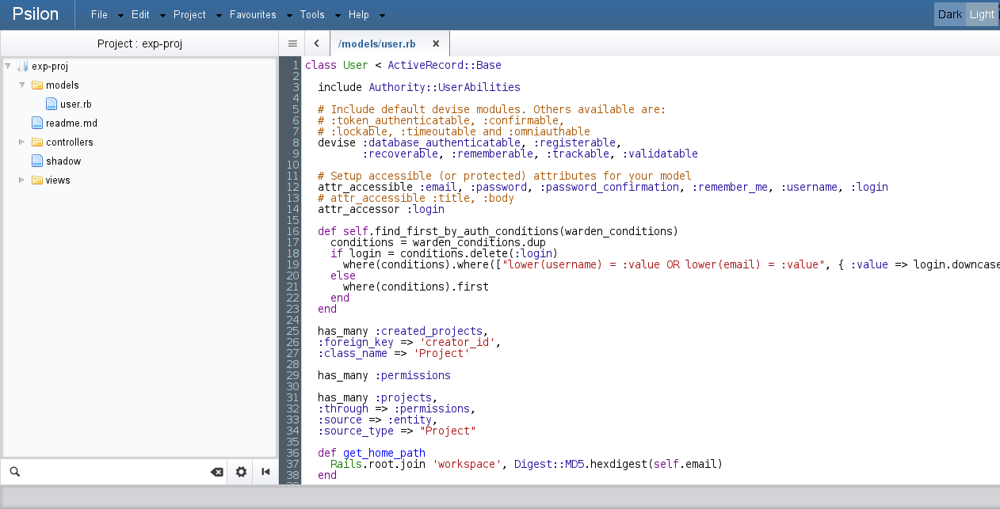

Psilon
======

Psilon is an experimental prototype of a web based IDE built upon Ruby on Rails framework. It is currently under initial stages of development and certainly not suitable for production.

License:
--------

Psilon codebase is available under GPLv3.0 license.